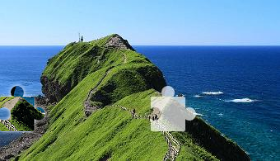

# Slider CAPTCHA Model

轻量级滑块验证码定位模型。输入验证码图片，输出滑块目标的 (x, y) 像素坐标。线上实测平均误差 < 1px。



## 1. 开箱即用

```bash
pip install -r requirements.txt

# 单张预测
python predict.py samples/captcha_image_0_150_85.png
# 输出: 150.1,84.4

# 批量预测
python predict.py --dir samples/ --verbose
```

```python
from predict import load_model, predict_image

model, device = load_model()  # 自动加载 models/ 下的权重
x, y = predict_image(model, 'captcha.png', device)
```

## 2. 小量数据微调

预训练模型在线上数据分布有偏差时，用 ~100 张标注样本即可微调适配。

**数据格式**：图片文件名包含坐标，如 `captcha_0_150_85.png` 表示滑块目标在图中 (150, 85) 位置，其中图片左上角定义为原点(0, 0)。对于纯水平滑块，实际上只需要x就够了，y可以忽略。

```bash
# 用 samples/ 做示例微调（实际使用你自己的线上数据）
python finetune.py --data_dir samples/ --epochs 200 --lr 5e-4

# 微调后推理
python predict.py --weights models/mini_yolo_finetuned.pth samples/captcha_image_0_150_85.png
```

微调脚本会在 `models/` 下保存 `mini_yolo_finetuned.pth`
